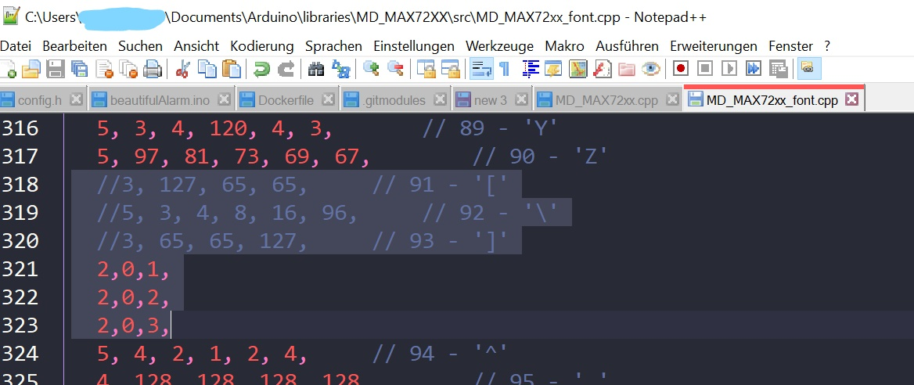

= beautifulAlarm

An alarm clock that looks and sounds just beautiful. Smart features are also available.

== Hardware

* ESP32 WEMOS LOLIN
* 8x32 LED Matrix
* DFPlayer mini
* Speaker <= 3W

== Installation

Install the following libraries in Arduino IDE:

----
#include <MD_Parola.h>
#include <MD_MAX72xx.h>
#include <ezTime.h>
#include "DFRobotDFPlayerMini.h"
----

Have a look at the picture below to adapt the font correctly.

