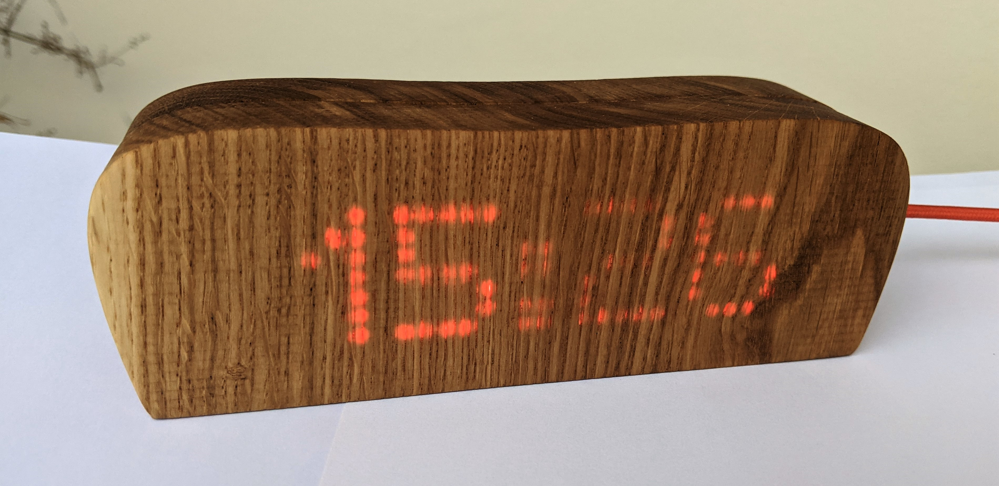
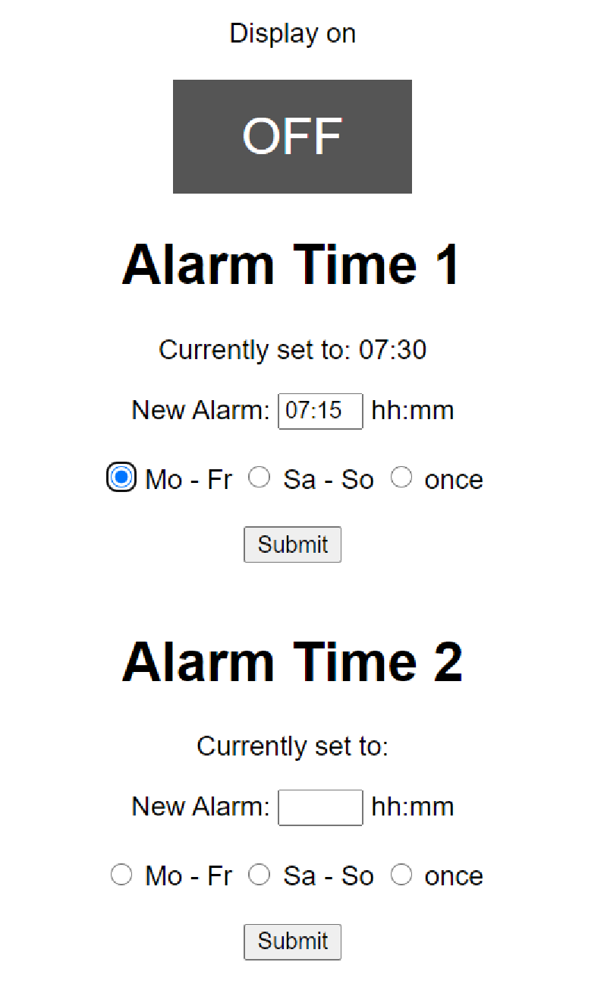

= BeatuifulAlarm Bedienungsanleitung
Stefan Spicker <spicker@outlook.com>
0.2, 18.12.2020
:pdf-page-size: A4

Der Wecker, der nicht nur schön aussieht, sondern auch schön klingt. Damit das Aufwachen wieder Spaß macht.

== Überblick

Der Wecker aus vollem Eichenholz kann in der <<overview>> bewundert werden.
Er beihnhaltet drei Berührungssonsoren, einen USB-micro Stecker für die Stromversorgung und eine SD-Karte für die Weckmelodien.

Zusätzlich kann sich der Wecker mit deinem WLAN verbinden, um immer die richtige Zeit anzuzeigen.
Ein integrierter Webserver macht das Einstellen der Weckzeiten so einfach wie nie.

.Vorderansicht
[#overview]

== Inbetriebnahme

Nach dem Einstecken zeigt der Wecker einen Willkommensgruß und verbindet sich mit dem WLAN.
Bei erfolgreicher Initialisierung wird die IP-Adresse angezeigt, über die durch einen Browser der Webserver erreicht werden kann.
Anschließend zeigt der Wecker die aktuelle Uhrzeit an, viel Spaß damit!

== Bedienung

Die Bedienung des Weckers ist auf zwei Arten möglich: Durch einen Webserver oder die Berührungssensoren.

=== Berührungssensoren

Die Funktion der Berührungssensoren ändert sich in den unterschiedlichen Zuständen des Weckers: Normal- und Alarmzustand.

Generell hat der Hauptsensor zwei Stufen: Langer und kurzer druck auf den Sensor, ein Druck länger als eine Sekunde wird als Langer druck erkannt.

Der Hauptsensor ist mittig über der vorderen Hälfte des Weckergehäuses zu finden, ein sehr kleiner blauer Punkt zeigt die Mitte des Sensors.
Ein genz leichter Druck auf die Sensorfläche des Weckers löst die folgenden Funktionen aus.

NOTE: Aktuell ist nur der Hauptsensor verbaut, in Zukunft kommen noch zwei weitere Sensoren hinzu.

==== Normalzustand

Wenn der Wecker gerade keine Weckmelodie spielt, sind folgende Funktionen verfügbar:

*Kurzer Druck*: Display An / Aus

*Langer Druck*: Zeigt zukünftige Weckzeiten an

==== Alarmzustand

Während der Wecker eine Weckmelodie spielt oder gesnoozed ist, sind folgende Funktionen aktiv:

*Kurzer Druck*: Snooze (Weckzeit für vier Minuten pausiert, maximal achtmal  möglich)

*Langer Druck*: Wenn dieser für mehr als vier Sekunden gehalten wird, wird die Weckmelodie ausgeschaltet.

NOTE: Wenn der Wecker im Alarmzustand drei Minuten lang nicht ausgeschaltet oder gesnoozed wird, wird automatisch ein Snooze durchgeführt.

=== Webserver

Der Webserver kann nach erfolgreicher Initialisierung über einen beliebigen browser im selben WLAN erreicht werden.
Dazu muss die IP-Adresse nur im Browserfenster eingegeben werden, und das folgende Menü erscheint:

.Webserver
[#webserver]

Hier können zwei Alarme, sowie der Status des Displays verändert werden.

Die Alarmzeiten müssen im Format HH:MM eingegeben werden (z.B. 07:00). Falsche Eingaben werden verworfen.
Bei erfolgreicher übernahme der Weckzeit zeigt das Display des Weckers eine Bestätigung.

WARNING: Die Alarmzeiten werden aktuell nicht permanent gespeichtert, nach einem Spannungsverlust sind alle Alarmzeiten gelöscht.

== Anzeige

Auf der Vorderseite des Weckers wird im Normalzustand die Uhrzeit angezeigt.
Wenn in den kommenden 24 Stunden eine Weckzeit eingestellt ist, zeigt das Display einen kleinen Punkt an der rechen oberen Ecke an.
Bei zwei Weckzeiten innerhalb der nächsten 24 Stunden werden zwei Punkte angezeigt.

Wenn der Wecker sich im "snooze" befindet, blinkt der oder die Punkte im Sekundentakt.

== SD Karte für Weckmelodien

Verwende bitte eine SD Karte mit den folgenden Eigenschaften:

* Weckmelodien werden nur im MP3 Format unterstützt.
* Die Namen der MP3 Dateien müssen mit einer vierstelligen Nummer beginnen (z.B. 0001.mp3, 0002.mp3 usw.)
* SD muss im format FAT formatiert werden

Die Melodien werden in zufälliger Reihenfolge gespielt.

== Bilder aus der Produktion und Entwicklung

link:productionpics.html[Zu finden hier]

== Fehlende Features

Stand: 16.12.2020

* Schönerer Webserver
* Weckzeiten dauerhaft speichern, auch beim Ausstecken
* Integration der beiden zusätzlichen Touchsensoren für manuelle Einstellungen
* Alle Einstellungen des Webservers auch lokal verfügbar machen
* OTA
* Adaptive Helligkeit, nach Sonnenuntergangszeiten
* (Option) Helligkeitssensor?
* WiFi Einstellungen ohne Kompilieren